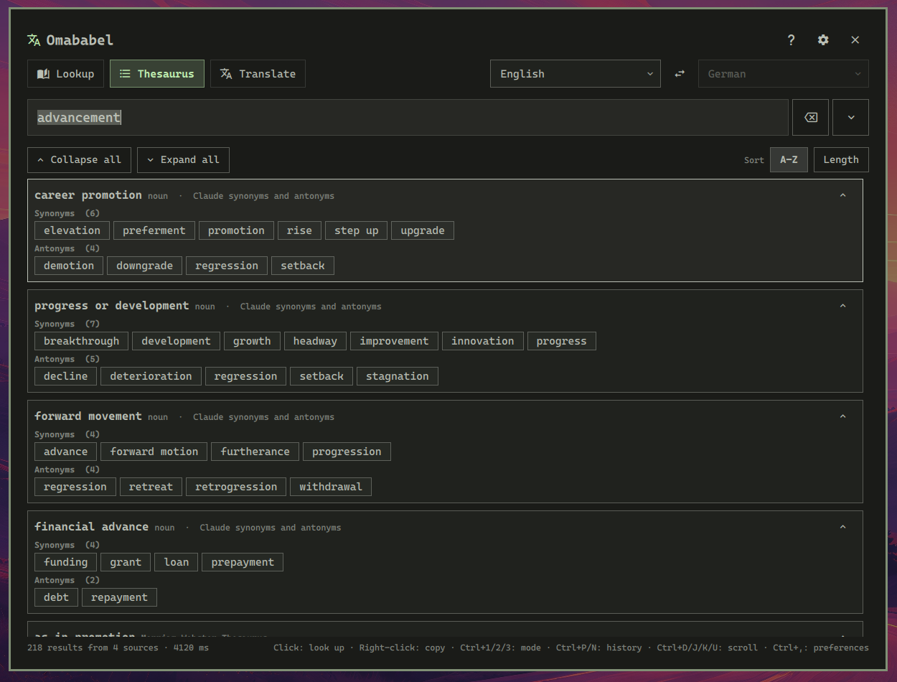

# Omababel

A dictionary, thesaurus and translation panel for [Omarchy](https://omarchy.org/)
(Omarchy Quattro and later) that offers three modes:

- **Lookup** - definitions from every dictionary configured for the selected
  language (Merriam-Webster, Duden, OED, Wiktionary, CC-CEDICT, ECDICT, Unihan, Claude, Gemini, Grok, ...)
  with one clearly separated results section per dictionary.

- **Thesaurus** - synonyms and antonyms from all configured thesauruses for the
  selected language (Thesaurus.com, Merriam-Webster, Wiktionary, Claude, Gemini, Grok, ...), grouped
  by meaning like thesaurus.com does it, plus a merged overview; words can be
  sorted alphabetically or by length.

- **Translate** - word-by-word translations (LEO, FreeDict, Wiktionary,
  CC-CEDICT, ECDICT, ...), full-text translation services 
  (Google Translate, DeepL, Claude, Gemini, Grok, ...) between the two selected languages.




A note on speed: web sources and local dictionaries are usually queried in milliseconds,
AI queries can take several seconds.


## Installation

```
omarchy plugin add https://github.com/muellan/omababel.git --enable
```

Open it from a terminal:

```
omarchy-shell shell toggle muellan.omababel '{}'
```

Bind it to a key by adding this to `~/.config/hypr/bindings.lua` and reloading
Hyprland:

```lua
o.bind("SUPER + SHIFT + SLASH", "Omababel", "omarchy-shell shell toggle muellan.omababel '{}'")
```

The payload can pre-fill the search. Looking up the primary selection
(highlighted text) is one binding away:

```lua
o.bind("SUPER + SHIFT + ALT + SLASH", "Look up selection",
  [[omarchy-shell shell summon muellan.omababel "{\"query\": \"$(wl-paste -p 2>/dev/null | head -c 200 | sed 's/"/\\"/g')\"}"]])
```

Payload keys: `query`, `mode` (`lookup` | `thesaurus` | `translate`),
`lang`, `lang2` (target language for translate).


### Dependencies

Required: 
  - Omarchy Quattro (`omarchy-shell`)
  - `python3` (part of every Omarchy install)
  - `wl-clipboard` for right-click copying.

Optional: 
  - `curl-impersonate` for more reliable web source scraping

Searching is done by a bundled, dependency-free Python 3 backend.
No third-party packages or build steps are required.
However, web source queries are more reliable when the arch package `curl-impersonate` is also installed
as it makes it easier for the plugin to pretend to be a browser when scraping websites.
The package can be installed with:
```
omarchy pkg add curl-impersonate
```


### Optional CLI

The same backend works from the terminal:

```
ln -s ~/.config/omarchy/plugins/muellan.omababel/bin/omababel ~/.local/bin/omababel
omababel lookup Haus --lang de
omababel thesaurus house --lang en
omababel translate "guten Morgen" --from de --to en
omababel data list
```


## Using the Panel

- The search field is focused when the panel opens; **Enter** searches.
- The **mode toggle** switches between lookup, thesaurus and translate
  (also `Ctrl+1` / `Ctrl+2` / `Ctrl+3`). Switching mode with a query in the
  field re-runs the search.
- Two **language selectors** (searchable). In lookup and thesaurus mode only
  the primary one is active; translate mode also uses the secondary (target)
  language. `Ctrl+S` or the 󰓡 button swaps them.
- The **history dropdown** (▾, `↓` in the field, or `Ctrl+H`) lists the last
  searches (1000 by default – see ⚙ → **History**), filtered by what you typed. `↑`/`↓` walk it, Enter re-runs an
  entry with its original mode and languages, × removes one, "Clear history"
  empties it.
- In the results, a **left click** on any word starts a new search with that
  word. A **right click** copies the word to the clipboard - or the whole
  translation when you click the output of a full-text translation service
  (Google, DeepL).
- Thesaurus results are grouped by meaning (part of speech, definition and
  source shown per group) with an "All meanings" overview at the end; the
  **A–Z / Length** switch sorts the words inside every group.
- The language selectors list English first, then all other languages
  alphabetically. Emptying the search field clears the results.
- Every source section has an *open ↗* link to the web page it came from.
- The **×** button right of the field (or `Ctrl+C` / `Ctrl+Backspace`) clears
  the field and the results.
- `Ctrl+P` / `Ctrl+N` step backwards / forwards through the search history and
  re-run the entry; `Ctrl+[` / `Ctrl+]` open the primary / target language
  picker; `Ctrl+D` / `Ctrl+U` scroll the results half a page.
- Result cards can be walked with `Ctrl+J` / `Ctrl+K` (the selected one has a
  brighter border) and folded away with the arrow in their header, with
  `Ctrl+O`, a double click, or the *Collapse all* / *Expand all* buttons that
  stay pinned above the list.
- 󰋖 or `Ctrl+.` opens the help panel with every shortcut and a link to this
  README; `Ctrl+,` or ⚙ opens the preferences, `Esc` goes back / closes the
  panel.

| Shortcut                      | Action                                                    |
|-------------------------------|-----------------------------------------------------------|
| `Enter`                       | Search                                                    |
| `Ctrl+1` `Ctrl+2` `Ctrl+3`    | Lookup / Thesaurus / Translate mode                       |
| `Ctrl+[` `Ctrl+]`             | Open the primary / target language picker                 |
| `Ctrl+S`                      | Swap languages                                            |
| `Ctrl+L`                      | Focus the search field                                    |
| `Ctrl+C` `Ctrl+Backspace`     | Clear field and results                                   |
| `↓` `Ctrl+H`                  | History dropdown                                          |
| `Ctrl+P` `Ctrl+N`             | Previous / next history entry                             |
| `Ctrl+D` `Ctrl+U`             | Scroll results down / up                                  |
| `Ctrl+J` `Ctrl+K`             | Select the next / previous result card                    |
| `Ctrl+O`                      | Collapse or expand the selected card (or double-click it) |
| `Ctrl+Shift+I` `Ctrl+Shift+O` | Collapse / expand every card                              |
| `Ctrl+A` `Ctrl+Z`             | Thesaurus mode: sort alphabetically / by length           |
| `Ctrl+.`                      | Help panel (all shortcuts, link to this README)           |
| `Ctrl+,`                      | Preferences                                               |
| `Esc`                         | Close popup / back / close panel                          |


## Sources and Preferences

The preferences have three tabs: **Sources**, **Data** (downloadable
dictionaries) and **History** (maximum number of remembered searches, plus a
button to clear the history).

⚙ → **Sources** lists every search source. Each row can be enabled/disabled
(disabled sources are not queried), edited, moved, deleted, or tested with a
sample word. **Add source** creates a new one.

The **filter bar** above the list has one toggle per property — *Enabled*,
*Disabled*, *Dictionary*, *Thesaurus*, *Translation* — each meaning "show
sources with this property". All of them start engaged; switching *Disabled*
off hides the disabled sources, leaving *Enabled* and *Thesaurus* on shows
the enabled thesaurus sources, and **Reset filter** puts everything back. The
dropdown next to them narrows by kind (AI services, web sources, local
dictionaries, Wiktionary, Freedict, with or without a stored key). The result of the last action — a test, an install, a
save — sits in its own strip above the list and stays there while the list
scrolls.

**Reordering** decides which source answers first. Click selects a row,
`Ctrl+click` adds or removes one, `Shift+click` takes a range, and the
selection can then be dragged with the mouse or moved with the ↑/↓ buttons as
a block. Because an order only means something when the whole list is on
screen, dragging is only offered while all sources — or at least all enabled
ones — are shown; the filter bar says so when it is not.

A source has:

| Field            | Meaning                                                                                                                                                                                        |
|------------------|------------------------------------------------------------------------------------------------------------------------------------------------------------------------------------------------|
| Enabled          | Off = not used in searches                                                                                                                                                                     |
| Source type      | `dictionary` (lookup mode), `thesaurus` (thesaurus mode) or `translator` (translate mode)                                                                                                      |
| Location         | *Remote (URL)* or *Local file*                                                                                                                                                                 |
| Driver           | How the source is read. Remote: AI Model, Duden, Merriam-Webster, OED, Thesaurus.com, LEO, Google Translate, DeepL or *Custom URL*. Local: *Local file*                                        |
| URL              | For remote sources. `{word}` is replaced by the query (custom translators may also use `{from}` / `{to}`)                                                                                      |
| File path        | For local sources, relative to `~/.local/share/omababel/` (absolute paths and `~` work too)                                                                                                    |
| Format           | Local sources: auto-detected, or force one of kaikki JSONL, FreeDict TEI, dictd, CC-CEDICT, ECDICT CSV, Unihan, TSV, JSON                                                                      |
| Languages        | Language codes this source serves (`de, en`). Empty = any                                                                                                                                      |
| Language pairs   | Translators: `de-en, en-de`. Empty = derived from *Languages* (or from the data for local files)                                                                                               |
| Translation kind | Translators: *word translations* (LEO-style pairs) or *full text service* (Google/DeepL-style)                                                                                                 |
| API key          | For paid/keyed services (Google Cloud Translation, DeepL, dictionaryapi.com, OED Researcher API, AI services). Stored in the system keyring, never in a file – see [Credentials](#credentials) |
| Key from env     | Alternative to the key field: the name of an environment variable holding the key                                                                                                              |
| Key from command | Alternative to the key field: a command whose output is the key (`pass show omababel/deepl`)                                                                                                   |
| Service / Access | AI sources only: which service (Claude, ChatGPT, Grok, Gemini, Muse) and whether it is reached through its signed-in CLI or its HTTP API                                                       |
| Model / Command  | AI sources only: override the service's default model, or the command that is run for the CLI access                                                                                           |


### Web Sources

Scraped sites (LEO, Duden, Merriam-Webster, Thesaurus.com …) start
answering `403` to a plain script after a handful of requests.
To circumwent this the plugin tries to mimick a browser:

|             |                                                                                                                                                                                                                       |
|-------------|-----------------------------------------------------------------------------------------------------------------------------------------------------------------------------------------------------------------------|
| Cookies     | Kept in `~/.cache/omababel/browser-state.json` and replayed – a session cookie is what separates a returning browser from a fresh script                                                                              |
| Headers     | Chrome's exact set in Chrome's order (client hints, `Sec-Fetch-*`, `Referer`), sent through `http.client` so the order really is ours                                                                                 |
| Rate        | One request per host at a time with a minimum gap and jitter; after a 403/429 a backoff (honouring `Retry-After`) that is **written to disk**, so the next lookup does not walk straight back into the block          |
| TLS         | Chrome's cipher list and curve preference, TLS 1.2+, no compression                                                                                                                                                   |
| Real Chrome | If [curl-impersonate](https://github.com/lwthiker/curl-impersonate) is installed (`curl_chrome131`, `curl-impersonate-chrome`), it is used for hosts that keep refusing – that is a byte-exact Chrome TLS fingerprint |

This is the default for **every** web source. Limitations of the bundled
Python implementation based solely on the standard library are that
`Accept-Encoding` does not advertise `br`/`zstd` (python cannot decode either)
and ALPN offers `http/1.1` only, since the standard library does not speak HTTP/2
(a server that selected `h2` would refuse). 
Installing `curl-impersonate` removes both restrictions.

```bash
omababel sources unblock          # forget cookies and pauses for every host
omababel sources unblock dict.leo.org
```

| Environment variable                                | Effect                                                         |
|-----------------------------------------------------|----------------------------------------------------------------|
| `OMABABEL_IMPERSONATE=0`                            | Send with plain urllib instead                                 |
| `OMABABEL_PROFILE=firefox`                          | Use the Firefox identity                                       |
| `OMABABEL_HOST_INTERVAL=2`                          | Minimum seconds between two requests to one host (default 0.8) |
| `OMABABEL_CURL_IMPERSONATE=/path/to/curl_chrome131` | Where the impersonating curl is                                |

`HTTP_PROXY` / `HTTPS_PROXY` / `NO_PROXY` are honoured; an https target is
tunnelled through the proxy so the handshake is still with the site.


### Security and credentials

**API keys and other credentials are never written to a file in plain text.**
They are stored in the login keyring of the session – Omarchy runs
gnome-keyring, which provides the freedesktop Secret Service – under the
attributes `service=omababel, id=<source id>`, and are read back only when a
source is actually queried. `sources.json` keeps the *fact* that a key exists
(`"has_key": true`), never the key itself.

The keyring is reached through `secret-tool` (libsecret), so no third-party
Python module is needed:

```bash
omababel    sources keyring           # is a keyring available?
omababel    sources key deepl         # reads the key from stdin, stores it
omababel    sources forget-key deepl  # removes it from the keyring
secret-tool search service omababel   # everything omababel stored
```

Two alternatives are offered for setups without a running keyring, and for
people who keep their secrets elsewhere:

* **Key from env** – the name of an environment variable (`DEEPL_API_KEY`),
* **Key from command** – a command whose first output line is the key
  (`pass show omababel/deepl`, `gopass …`, `age -d …`).

Both are consulted before the keyring, and neither stores the secret itself.
**Key from command runs through the shell on every search that uses the row**
– it is a line of your configuration the way an alias in `.bashrc` is, so put
only a command there you would type yourself.

Keys written to `sources.json` by an earlier version are moved into the
keyring the first time the new version reads the file. If no keyring can be
reached, such a key stays where it is and both the preferences panel and
`omababel sources list` flag it – set it again once a keyring is running.
Never put a key into the URL of a custom source: URLs *are* stored in
`sources.json`.

A stored key still has to survive the trip to the service:

* **https or nothing.** A request that carries a credential (an API key, an
  `Authorization` header, a cookie) is refused unless the URL is `https://`.
  That covers the built-in services, a custom AI endpoint and a custom source
  with a key alike: the panel says so instead of putting the key on the wire
  in the clear.
* **Credentials never survive a redirect.** Every `Location` is validated
  before it is followed – only `http(s)`, never a downgrade from https to
  http. A redirect to *another* origin while the request carries a credential
  is refused outright; a redirect to another origin without one is followed
  with all sensitive headers stripped. Only a same-origin redirect keeps the
  key.
* **No secret in the process table.** The optional `curl-impersonate` path
  is handed to curl through a config file created with mode `0600` and 
  removed again afterwards, so nothing confidential appears in `/proc`.
  Curl is run with `-q`, so an `--insecure` or a `--proxy` left in your
  `~/.curlrc` for something else cannot apply to a keyed request.
* **A key never appears in a message.** Some services only take a key in the
  query string (`?key=…`). Before a URL goes into an error message, into a
  result the panel shows, or into the browser via a card's *open ↗*, the value
  of any parameter that names a secret is replaced by `***`. A wrong key is
  exactly the case that produces the error you would otherwise paste into a
  bug report.


A dictionary site, an AI answer and a downloaded dictionary file are all
written by somebody else. So:

* nothing scraped reaches the panel as markup – every result field is escaped
  before rendering, and the one rich-text element additionally drops any tag
  outside a small allowlist, because Qt's rich text would fetch an
  `` for whoever put it there;
* a link a card offers to open is checked for `http(s)` first, and a scraped
  link is resolved against the site it came from rather than followed
  wherever it points;
* copied text has terminal control sequences removed, since a paste into a
  terminal is where it usually ends up;
* nothing a remote party sends can name a local path: a dataset's file name is
  reduced to a plain name and the result is asserted to be inside the download
  directory, and a dataset may only be fetched over https from the hosts in
  the catalogue;
* a downloaded archive's members are written `0600` with the `data` extraction
  filter, so an archive cannot leave a setuid or world-writable file behind.

The plugin itself is installed and updated by `omarchy plugin add|update`,
which tracks the repository's default branch. There is no signature or pin in
that model, so an update is trust in this repository – as it is for every
plugin.


### Response limits

A remote service could otherwise decide how much memory the plugin uses.
Everything coming back is therefore read against a ceiling, and going over one
ends the request with an ordinary error message:

| Limit                       | Default | Environment variable      |
|-----------------------------|---------|---------------------------|
| Compressed bytes read       | 8 MiB   | `OMABABEL_MAX_BODY`       |
| Bytes after gzip/deflate    | 32 MiB  | `OMABABEL_MAX_DECODED`    |
| An AI CLI's answer          | 2 MiB   | `OMABABEL_AI_MAX_REPLY`   |
| One backend line to the panel | 4 MiB | `OMABABEL_MAX_REPLY`      |
| One dataset download        | 4 GiB   | `OMABABEL_MAX_DOWNLOAD`   |

Error bodies are cut at 64 KiB (only a line of them is ever shown), gzip and
deflate are inflated incrementally so a decompression bomb is refused after
the first chunks rather than after the last, and the `curl-impersonate`
subprocess is drained through the same capped reader and killed when it goes
past it. A search result that would exceed the line limit keeps its place in
the list and carries an error instead, so the panel never receives a line it
cannot parse.


### Built-in Remote Sources

| Source                                              | Type                        | Notes                                                                                                                                                        |
|-----------------------------------------------------|-----------------------------|--------------------------------------------------------------------------------------------------------------------------------------------------------------|
| [Duden](https://www.duden.de/)                      | dictionary (de)             | Meanings, examples, grammar, origin, synonyms                                                                                                                |
| [Merriam-Webster](https://www.merriam-webster.com/) | dictionary + thesaurus (en) | Optional free [dictionaryapi.com](https://dictionaryapi.com/) key (one per reference)                                                                        |
| [Oxford English Dictionary](https://www.oed.com/)   | dictionary (en)             | Subscription site - **disabled by default**; free access only yields search snippets, an OED Researcher API credential (`app_id:app_key`) gives full entries |
| [Thesaurus.com](https://www.thesaurus.com/)         | thesaurus (en)              |                                                                                                                                                              |
| [LEO](https://www.leo.org/)                         | translator, word            | German ↔ English/French/Spanish/Italian/Chinese/Russian/Portuguese/Polish                                                                                    |
| Google Translate                                    | translator, text            | The key-less endpoint rate-limits after a few requests; add a Cloud Translation API key for steady use                                                       |
| DeepL                                               | translator, text            | **Disabled by default** (the key-less endpoint rate-limits within a few requests); add a DeepL API key (free keys end in `:fx`) and enable it                |
| AI service                                          | all three modes             | Claude, ChatGPT, Grok, Gemini or Muse - **disabled by default**; see [AI Services](#ai-services)                                                             |

The web sources are scraped from the public pages (like a browser would).
Page layouts change; when a source stops returning results, check for a plugin
update or report it. Using them is subject to the sites' terms.


### AI Services

Three built-in rows - **AI explanation** (lookup), **AI synonyms and antonyms**
(thesaurus) and **AI translation** - ask an AI service instead of a dictionary
site. They are **disabled by default**; enable the ones you want in
⚙ → Sources. An AI source answers in *any* language.

| Mode      | What it returns                                                                         |
|-----------|-----------------------------------------------------------------------------------------|
| Lookup    | One succinct explanation of the term, with a part of speech and one example             |
| Thesaurus | Synonyms and antonyms, grouped by meaning, one card per meaning                         |
| Translate | The best meaning-preserving translation, plus alternatives and a note about ambiguities |

**Service**: Claude, ChatGPT, Grok, Gemini or Muse.

**Access**: two ways to reach it.

* **Signed-in CLI** (the default) runs the service's own command line tool,
  which is already signed in with your account: `claude -p` for Claude,
  `gemini -p` for Gemini, and so on. A **free plan is used as it is, and so is
  a paid one** - a Claude Pro or Max subscription needs no API key and is not
  billed per request. Nothing is stored, and the *Command* field can point at
  any other program that reads a prompt on stdin and answers on stdout.
* **HTTP API + key** calls the service's API instead, following each
  service's own reference (Anthropic's Messages API with `X-Api-Key` and
  `anthropic-version`, Gemini's `generateContent` with `x-goog-api-key`, and
  the OpenAI-compatible chat endpoint with a bearer token for ChatGPT, Grok
  and Muse). The key is stored in the keyring (see
  [Credentials](#credentials)).

  **Models are not hardcoded.** Leave *Model* empty and the plugin asks the
  service which models the key may use (`/v1/models` and friends, cached for
  a day) and picks the smallest one - a fixed id would answer `404` the day
  it is retired. A model that stops existing is looked up again and retried
  once; a `404` that survives that names the models the key can actually use.
  Fill *Model* in to pin one, and *API endpoint* to point at something else
  entirely, such as a self-hosted OpenAI-compatible server – it has to be an
  `https://` URL, since the key travels with every request (see
  [Credentials](#credentials)).

The plugin asks for a strict JSON answer and parses it defensively (code
fences, a chatty preamble or a CLI banner are all tolerated), so a talkative
model cannot break the panel. `OMABABEL_AI_TIMEOUT` (default 60 s) bounds how
long a service may take.


### Local Dictionaries (Downloaded on Demand)

⚙ → **Data** lists the installed datasets first, then everything else, both
halves alphabetical and separated by a line.

Local sources give you offline, key-free lookups and are the only way to get
dictionaries for many languages. The big dumps are hundreds of MB and carry
their own licences (CC BY-SA / GPL), so they are **not** in this repository:
install what you need from ⚙ → **Data**, or with `omababel data install <id>`.
Each dataset is downloaded once, indexed into an SQLite file under
`~/.local/share/omababel/` and the download is deleted again.

| Dataset id                 | Content                                                                                                               | Source                                                                                                                                                  | Licence            |
|----------------------------|-----------------------------------------------------------------------------------------------------------------------|---------------------------------------------------------------------------------------------------------------------------------------------------------|--------------------|
| `wiktionary-<lang>`        | All `<lang>` words of the English Wiktionary: English definitions, synonyms/antonyms, translations, inflections       | [kaikki.org](https://kaikki.org/dictionary/rawdata.html)                                                                                                | CC BY-SA / GFDL    |
| `wiktionary-<lang>-native` | `<lang>` words of the `<lang>` Wiktionary edition: definitions and synonyms *in that language* (e.g. German → German) | kaikki.org                                                                                                                                              | CC BY-SA / GFDL    |
| `freedict-<xxx>-<yyy>`     | FreeDict bilingual word dictionaries (`deu-eng`, `eng-deu`, `deu-fra`, `spa-eng`, `jpn-deu`, `eng-zho` ...)           | [FreeDict](https://github.com/freedict/fd-dictionaries)                                                                                                 | GPL                |
| `cedict`                   | CC-CEDICT Chinese -> English with pinyin (~120k words)                                                                | [edvardsr/cc-cedict](https://github.com/edvardsr/cc-cedict) / MDBG                                                                                      | CC BY-SA 4.0       |
| `ecdict`                   | ECDICT: 770k English headwords with IPA, English definitions, Chinese translations, inflections                       | [skywind3000/ECDICT](https://github.com/skywind3000/ecdict)                                                                                             | MIT                |
| `unihan`                   | Unihan: readings and definitions for ~98k Han characters (Mandarin, Cantonese, Japanese, Korean)                      | [unicode.org](https://www.unicode.org/Public/UCD/latest/ucd/Unihan.zip) / [unicode-org/unihan-database](https://github.com/unicode-org/unihan-database) | Unicode License v3 |

Default languages - German, English, Chinese (Mandarin), French, Spanish,
Portuguese, Japanese - come pre-configured with source rows for all of the
above (they show *not installed* until you download the data). `omababel data
list` prints the full catalogue, including the Wiktionary sets for ~40 more
languages.

Typical setup for German ↔ English:

```
omababel data install wiktionary-de wiktionary-de-native wiktionary-en freedict-deu-eng freedict-eng-deu
```

(`wiktionary-en` is the whole English Wiktionary - about 2 GB to download.)
You can also feed a file you downloaded yourself:
`omababel data import wiktionary-de ~/Downloads/kaikki.org-dictionary-German.jsonl`.


## Adding Your Own Sources

**A web dictionary** - choose *Remote (URL)* with the *Custom URL* driver and
enter the page URL with `{word}` where the query goes, e.g.
`https://www.dwds.de/wb/{word}`. The page's readable text is shown as the
result; JSON APIs are flattened (and `synonyms`/`antonyms` arrays are picked
up for thesaurus rows). An API key is sent as `Authorization: Bearer ...` or
substituted for `{key}` in the URL; a source with a key needs an `https://`
URL.

**A local dictionary file** - put the file into `~/.local/share/omababel/`
(or use an absolute path) and add a *Local file* source pointing at it. The
first search builds an index in `~/.cache/omababel/`. Supported formats:

- kaikki.org / wiktextract JSONL (`.jsonl`, optionally `.gz`)
- FreeDict TEI (`.tei`, `.src.tar.xz`)
- dictd (`.index` + `.dict` / `.dict.dz`)
- CC-CEDICT text (`cedict_ts.u8`) or `all.js` from edvardsr/cc-cedict
- ECDICT CSV
- Unihan (`Unihan.zip`, a directory of `Unihan_*.txt`, or single property files)
- Tab separated: `word<TAB>definition[<TAB>part of speech]` (`|` separates senses)
- JSON: `[{"word": ..., "lang": ..., "pos": ..., "senses": [{"gloss": ..., "synonyms": [...], "antonyms": [...]}], "translations": {"en": [...]}}]`

One file can back several rows: e.g. a Wiktionary index as a *dictionary*
row, a *thesaurus* row (its synonyms/antonyms) and a *translator* row
(its translation table - both directions work).

**Word vs. full-text translators** - the *Translation kind* only affects how
results are presented and copied: word translators show `source → target`
pairs and a right click copies one side; full-text services show the translated
text and a right click copies all of it.


### Where data is stored

| File                                   | Purpose                                                                                                                                      |
|----------------------------------------|----------------------------------------------------------------------------------------------------------------------------------------------|
| `~/.config/omababel/sources.json`      | The source list (`omababel sources path`). Built-ins added by updates are merged in; deleted built-ins stay deleted. Contains no credentials |
| `~/.config/omababel/prefs.json`        | Last mode, languages and thesaurus sort order                                                                                                |
|----------------------------------------|----------------------------------------------------------------------------------------------------------------------------------------------|
| `~/.local/state/omababel/history.json` | Search history (size set in ⚙ → History, default 1000)                                                                                       |
| `~/.local/share/omababel/`             | Dictionary data and indexes                                                                                                                  |
| `~/.cache/omababel/`                   | Indexes built from raw local files                                                                                                           |
|----------------------------------------|----------------------------------------------------------------------------------------------------------------------------------------------|
| login keyring (gnome-keyring)          | API keys and other credentials, under `service=omababel` – see [Credentials](#credentials)                                                   |

`omababel sources reset` restores the built-in list.


## Testing

```
tests/run.sh            # everything
tests/run.sh --python   # backend unit tests only (no dependencies)
```

The Python suite (100+ tests, stdlib `unittest`) covers every parser and
importer with offline fixtures, the SQLite index, configuration, history, the
JSON protocol and the CLI. The QML part is checked with `qmllint` and an
offscreen run of the panel against fixture data (needs an Omarchy shell
checkout - `$OMARCHY_PATH` - plus `pip install PySide6` or `qmlscene`).
`OMABABEL_LIVE=1 python3 tests/live_smoke.py` queries every remote source for
real and prints what came back - run it when a site changed its layout.


## How It Works

```
Omababel.qml         panel UI (Quickshell, qs.Commons / qs.Ui kit)
Ob*.qml              results view, preferences, backend bridge, installer
backend/omababel.py  one JSON request in, one JSON reply out (+ a CLI)
backend/ob/          sources/ (drivers), formats/ (importers), store.py (SQLite),
                     search.py (concurrent orchestration), data.py (datasets)
```

Every request spawns `python3 backend/omababel.py`, which queries all
applicable sources concurrently, normalises the results, pre-renders the
clickable words and returns JSON. A search **streams**: the set of sources
comes first, then one line per source as it finishes, and the reply carries
the complete answer — so the panel shows a card per source right away and
fills each one in as it answers, instead of waiting for the slowest (an AI
service can take tens of seconds). A spinning 󰑐 in the accent colour marks a
query that is still running. Local formats are converted into one SQLite
schema so lookups, thesaurus queries and word translations share the same code.


## Removal

```
omarchy plugin remove muellan.omababel
rm -r ~/.config/omababel ~/.local/share/omababel ~/.local/state/omababel ~/.cache/omababel
```


## License

MIT - see [LICENSE](LICENSE). The plugin bundles no third-party code or data;
the shell UI kit (`qs.Commons`, `qs.Ui`) is provided by Omarchy at runtime and
the dictionary datasets are downloaded on demand under their own licences
listed above.
